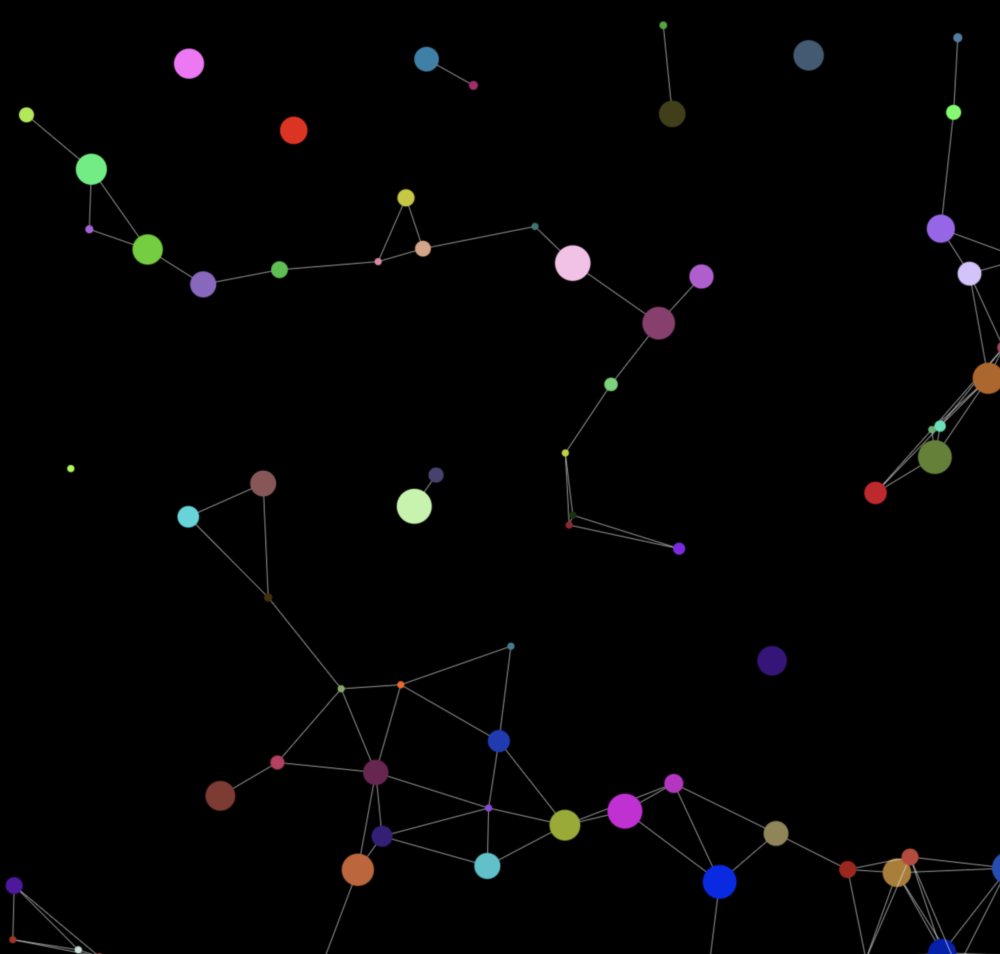

# js-particles-factory

js-particles-factory is a JavaScript library designed to create and animate particles on an HTML canvas element. The particles float around and interact.<br>

This library allows you to customize particles with various shapes, sizes, and behaviors, and provides interactive and visually appealing effects for web applications.

Built with vanilla JS/HTML/CSS<br>
No dependencies

---

[Installation](#installation)<br>
[Usage](#usage)<br>
[Example](#example)<br>
[API](#api)<br>
[ParticlesFactory](#particlesfactory)<br>
[Particle](#particle)<br>
[License](#license)<br>

---

## Features

* Customizable Particles:<br>
Define shapes (circle, square, rhombus, hexagon, triangle), sizes, speed and colors.

* Collision Detection:<br>
Particles can interact with each other and respond to collisions.

* Responsive Design:<br>
Adjusts to window resizing and fullscreen modes.

* Mouse Interaction:<br>
Particles react to mouse movements.

* Flexible Animation Controls:<br>
Start, stop, and adjust particle animation settings.

* Simply adjustable, throttled  framerate (requestAnimationFrame)


---
## Installation
You can install js-particles-factory via npm:

```js
npm install js-particles-factory
```
Alternatively, include it directly in your HTML with a script tag:
```
<script type="module">
  import { ParticlesFactory } from 'https://unpkg.com/js-particles-factory@1.0.2/dist/particles-factory.es.js';
</script>
```
or copy the [particle.factory.es.js](./minified/particles-factory.es.js) into your project and import **ParticlesFactory** directly.<br>
(CDN will follow)

---
## Usage

### Basic Setup<br>
Create an HTML Canvas Element

```
<canvas id="particles-canvas"></canvas>
```
### Builtin config with default-settings
Whether you pass your own config-Object or only pass some changes in an object to the constructor, the defaults get merged with your arguments.<br>
To create and download your own config please viist the interactive version here:


```js
// Default configuration
	static defaultConfig = {
		canvas: {
			id: 'particles-canvas',
			width: 500,
			height: 500,
		},
		main: {
			frameRate: 30,
			numParticles: 80,
			speed: 0.2,
			mouseDistance: 80,
			fillStyle: '#000',
			isFullScreen: true,
			isResponsive: true,
		},
		particles: {
			shape: 'triangle',
			fillStyle: '#ff0000',
			randomFill: true,
			noFill: false,
			stroke: true,
			size: 44,
			randomSize: true,
			draw: true,
			collision: false,
			opacity: 1,
		},
		lines: {
			connectDistance: 100,
			strokeStyle: '#ffffff',
			draw: true,
			lineWidth: 0.5,
			opacity: 1,
		},
	};


```
### Initialize the Particle System

```js
import { ParticlesFactory } from 'js-particles-factory';
```
Minimal initialisation with all default settings:
```js
// requires a canvas with the exact id "particles-canvas"
const particles = new ParticlesFactory();
```
Initialisation with eg just another canvasId:<br>
(**Note:** you need to pass the individual settings as object.)
```js
const particles = new ParticlesFactory({canvas:{id: "your-canvas-id"}});
```


#### Instantiate it with your own full config
To **create and download your own configuration object** you can use this interactive version:

[](https://particles-factory.netlify.app/)

```js
const particles = new ParticlesFactory(yourConfigObject);
```
## Example
Click [here](https://github.com/BarbWire-1/js-particles-factory-example) to see an example usage.

---

## API
## ParticlesFactory<br>
#### Constructor:

```js
new ParticlesFactory(options)
```
#### Options:

Configuration object for the particle system.<br>
The above passed objects shows the defaultSettings.


## Configuration Options
<details>
<summary>Click here for detailed description</summary>

* ### Canvas<br>
  * id: ID of the canvas element.<br>
  * width: Width of the canvas.<br>
  * height: Height of the canvas.<br><br>
* ### Main<br>
  * frameRate: Animation frame rate.<br>
  * numParticles: Number of particles to generate.<br>
  * speed: Base speed of particles.<br>
  * mouseDistance: Distance within which particles react to the mouse.<br>
  * fillStyle: Background color of the canvas.<br>
  * isFullScreen: Toggle fullscreen mode.<br>
  * isResponsive: Adjust canvas size on window resize.<br>


* ### Particles
  * shape: Shape of the particles.<br>
  * fillStyle: Base color of particles.<br>
  * randomFill: Whether particles have random colors.<br>
  * noFill: Whether particles are transparent.<br>
  * stroke: Whether particles have a stroke.<br>
  * size: Base size of particles.<br>
  * randomSize: Whether particles have random sizes.<br>
  * draw: Whether to draw particles.<br>
  * collision: Whether to detect collisions.<br>
  * opacity: Opacity of particles.<br>

* ### Lines
  * connectDistance: Distance within which lines are drawn between particles.<br>
  * strokeStyle: Color of the lines.<br>
  * draw: Whether to draw lines.<br>
  * lineWidth: Width of the lines.<br>
  * opacity: Opacity of the lines.<br>
</details>

## Methods:

  * setFillMode(mode)<br>
Set the fill mode for particles.<br>
Modes: "noFill", "random", "fill".

  * setSpeed(newSpeed)<br>
Update the speed of particles.

  * setNumParticles(newValue)<br>
Update the number of particles in the system.

  * setBaseSize(newBaseSize)<br>
Adjust the new base size of all particles when they're set to randomSize.

  * toggleFullScreen()<br>
Toggle between fullscreen mode and canvas size.

  * toggleAnimation()<br>
Start or stop the animation.


## Particle
The Particle class is not exposed but component of the ParticlesFactory
<details>
  <summary>Click to expand for more details</summary>

### Constructor:
```js
new Particle(canvas, x, y, size, speed, fillStyle)
```
canvas: The canvas element.<br>
x: X-coordinate of the particle.<br>
y: Y-coordinate of the particle.<br>
size: Size (diameter) of the particle.<br>
speed: Movement speed of the particle.<br>
fillStyle: Color of the particle.<br>

### Methods:

drawParticle(fillColor, opacity, size, shape, strokeStyle)<br>
Draw the particle on the canvas.

keepInBoundaries(drawParticles)<br>
Ensure the particle stays within the canvas boundaries.

particlesCollision(isRandomSize, commonSize, particle, otherParticle, distance)<br>
Handle collisions between particles.

updateCoords(drawParticles)<br>
Recalculate the particle’s coordinates.

updateSpeed(speed)<br>
Update the particle’s speed (on collision).

handleMouseMove(event, mouseDistance, canvasX, canvasY)<br>
Handle the particle's behavior when the mouse moves nearby.


</details>

---
## Contributing
Contributions are welcome! Please submit issues or pull requests via GitHub. For more information on how to contribute, see CONTRIBUTING.md.

## License
This project is licensed under the MIT License - see the LICENSE file for details.
